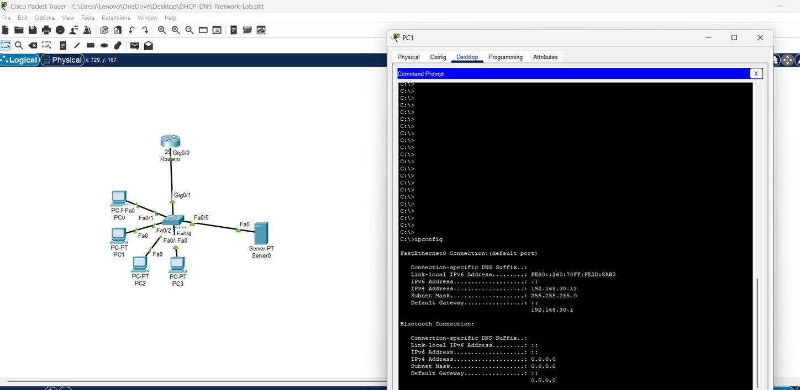
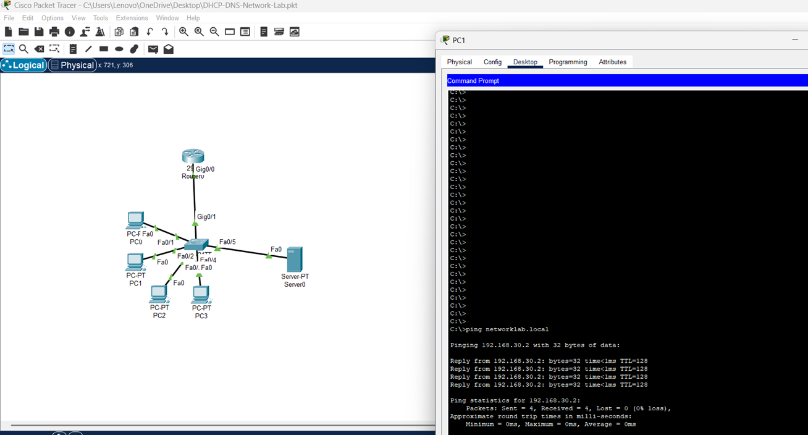
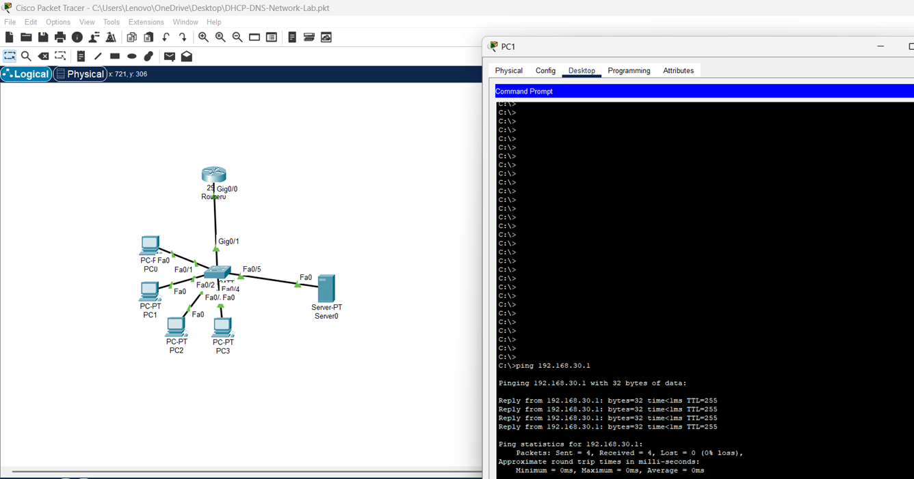

# DHCP and DNS Network Lab

Cisco Packet Tracer network demonstrating DHCP configuration DNS resolution and basic network connectivity.

## Network Setup

The network consists of one router one switch four PCs and one server.

The router provides DHCP services and the server provides DNS services.

## IP Addressing

Router Gateway: `192.168.30.1`

DNS Server: `192.168.30.2`

PC0: `192.168.30.11`

PC1: `192.168.30.12`

PC2: `192.168.30.13`

PC3: `192.168.30.14`

Subnet Mask: `255.255.255.0`

## Configuration

DHCP was configured on the router to automatically assign IPv4 addresses to the PCs.

The DNS server was configured with the domain `networklab.local`.

The router interface was configured as the default gateway for the network.

## Testing

DHCP configuration was verified using `ipconfig`.

Gateway connectivity was tested using `ping 192.168.30.1`.

DNS resolution was tested using `ping networklab.local`.

The final connectivity tests achieved 0% packet loss.

## Screenshots
## Screenshots

### Network Topology

### DHCP Configuration

### DNS Test

### Gateway Test

## Project Files

`DHCP-DNS-Network-Lab.pkt`

`commands.txt`

## Skills

Cisco Packet Tracer
DHCP
DNS
IPv4
Network Troubleshooting
Basic Network Configuration
