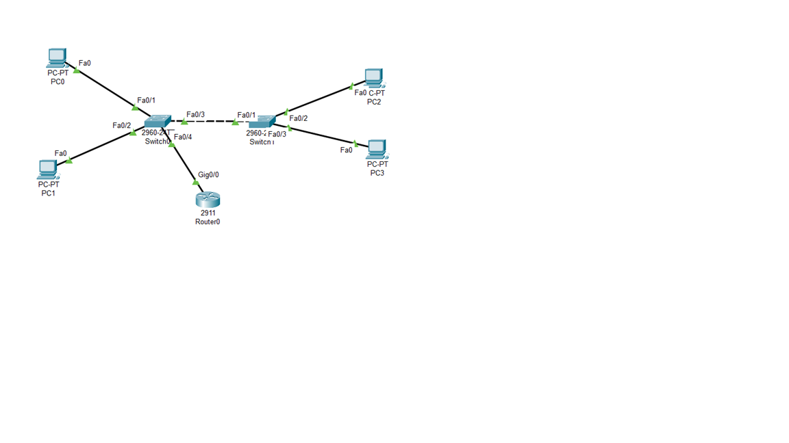

# VLAN & Inter-VLAN Routing Lab
## Overview

Cisco Packet Tracer networking lab demonstrating VLAN configuration, trunking, and Inter-VLAN Routing using Router-on-a-Stick.

## Network

- 1 Router
- 2 Switches
- 4 PCs
- VLAN 10
- VLAN 20
- 

## IP Addressing

### VLAN 10
- PC0: 192.168.10.10
- PC2: 192.168.10.11
- Gateway: 192.168.10.1

### VLAN 20
- PC1: 192.168.20.10
- PC3: 192.168.20.11
- Gateway: 192.168.20.1

## Technologies

- Cisco Packet Tracer
- VLAN
- Trunking
- Router-on-a-Stick
- IPv4
- Inter-VLAN Routing
- Network Troubleshooting

## Testing

Connectivity was tested using ping between devices in different VLANs.

All final connectivity tests achieved 0% packet loss.

## Project File

VLAN GITHUB HAYA.pkt
